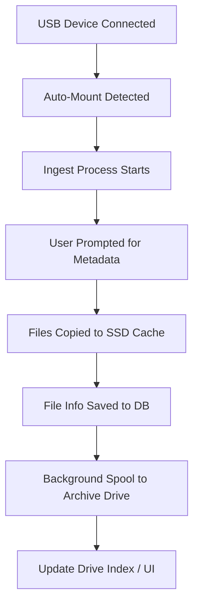

# USB Archive Box

A low-cost, open-source archival and media management system built using Raspberry Pi (or similar SBC), USB 3.0 storage devices, and a smart web interface.

## Overview

The USB Archive Box is designed for photographers, videographers, collectors, and data hoarders who want to:

* Store large volumes of data without relying on cloud services.
* Automatically ingest and categorize media from cameras, phones, drones, etc.
* Maintain fast, local access to recent files while archiving older files to low-cost external drives.
* Track drive contents, session metadata, and expiration goals for long-term projects.

## Features

* **Plug-and-ingest:** Auto-detect and import files from USB-connected devices (phones, SD readers, etc.)
* **Metadata prompts:** Tag imports with names, descriptions, locations, and retention policies.
* **SSD write cache:** Write first to SSD, then spool files in background to bulk archive drives.
* **File rotation:** Move oldest files monthly from active storage to archival drives.
* **Spin-down archive support:** Spun-down drives except during scheduled writes to preserve lifespan.
* **Inventory tracking:** UI and database index showing what files are on which drive.
* **Session history:** List past ingest sessions with previews and notes.
* **Print labels:** Generate labels with directory listings and retention periods for offline stored drives.
* **Drive migration:** Copy oldest archive to newer, larger drives, flag old as cold backup.

## Target Hardware

* Raspberry Pi 4/5, Orange Pi, or similar SBC
* USB 3.0 hub (preferably powered)
* SSD or NVMe for cache (via USB or PCIe, depending on model)
* Multiple USB hard drives (WD EasyStore, Seagate, etc.)

## Software Stack

* OS: Raspberry Pi OS / Ubuntu Server
* Backend: Python (Flask/FastAPI)
* Frontend: HTML/CSS/JavaScript (Bootstrap optional)
* DB: SQLite or lightweight JSON-based index
* File handling: rsync / inotify / udev

## Planned Add-Ons

* AI-powered tagging of media using onboard or USB TPU (Pi 5 + Coral)
* Face/object recognition in photos
* Scheduled syncs to secondary cold storage drives
* Backup verification with checksums
* Integration with Plex/Jellyfin metadata

## Goals

* Plug-and-play simplicity
* No vendor lock-in
* Resilient and traceable storage workflow
* Ideal for long-term archival at minimal ongoing cost

## Project Layout

```bash
usb-archive-box/
├── ingest/
│   └── ingest.py
├── db/
│   └── archive_index.db
├── ui/
│   └── webapp.py
├── static/
│   └── css/, js/
├── templates/
│   └── index.html
├── spooler/
│   └── rotate.py
└── README.md
```

## Example Flowchart



## Example Code Stubs

### ingest.py

```python
"""
Monitors USB devices for new media and imports them into the cache directory.
"""
def monitor_usb():
    pass

def ingest_media(device_path, metadata):
    pass
```

### rotate.py

```python
"""
Spools oldest files to archival USB drives on a scheduled basis.
"""
def rotate_oldest_files():
    pass
```

### db.py

```python
"""
Tracks what files are on which drives and retains metadata.
"""
def add_file_record(filename, drive_id, metadata):
    pass

def get_drive_contents(drive_id):
    pass
```

## GitHub Project Ideas

* [ ] USB detection and import script
* [ ] Web UI file explorer
* [ ] SQLite drive/media tracker
* [ ] Archive rotation logic
* [ ] Label printer support

## License

MIT License — free to use, fork, and expand.

---

Let us know if you're interested in collaborating on this project!
